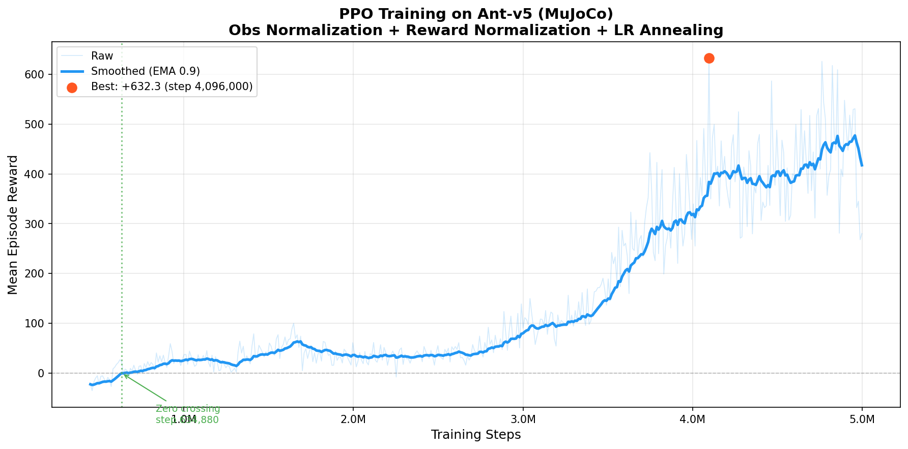

# 05 — PPO Ant Walker (MuJoCo)

Training a quadruped ant to walk using PPO — first from state vectors, then from raw pixel observations with a CNN encoder.

---

## Overview

This project implements Proximal Policy Optimization (PPO) from scratch using PyTorch to solve the MuJoCo Ant-v5 continuous control task. The agent controls 8 joint torques to make a four-legged ant walk forward as fast as possible while staying upright.

The project has two phases:

1. **State-based PPO** — the agent observes a 105-dimensional state vector (joint angles, velocities, etc.) and learns through a simple MLP network.
2. **Pixel-based PPO** — the agent observes only raw camera images (84×84 RGB) and learns through a CNN encoder, with no access to proprioceptive state information.

Key techniques include running observation/reward normalization (Welford's algorithm), linear learning-rate annealing, DrQ-style data augmentation, and optional domain randomization.

---

## Architecture

### State-based (MLP)

```
                       +----------------------------+
                       |        ActorCritic         |
                       |                            |
  obs (105-dim)        |  +--------------------+    |
  -------------------->|  | Actor Trunk        |    |--> action mean (8-dim)
                       |  | Linear(105, 256)   |    |    + learnable log_std
                       |  | Tanh               |    |
                       |  | Linear(256, 256)   |    |
                       |  | Tanh               |    |
                       |  | Linear(256, 8)     |    |
                       |  +--------------------+    |
                       |                            |
                       |  +--------------------+    |
                       |  | Critic Trunk       |    |--> state value (scalar)
                       |  | Linear(105, 256)   |    |
                       |  | Tanh               |    |
                       |  | Linear(256, 256)   |    |
                       |  | Tanh               |    |
                       |  | Linear(256, 1)     |    |
                       |  +--------------------+    |
                       +----------------------------+
```

### Pixel-based (CNN)

Image observation (84×84 RGB, 3-frame stack)
-> CNN Encoder: Conv8×8/s4(32) -> Conv4×4/s2(64) -> Conv3×3/s1(64) -> FC(256)
-> 256-dim latent vector (shared)
-> Actor Head: Linear(256,256) -> Tanh -> Linear(256,8) -> action mean + learnable log_std
-> Critic Head: Linear(256,256) -> Tanh -> Linear(256,1) -> state value

The CNN encoder is shared between actor and critic. During training, DrQ-style random shift augmentation (pad 4px + random crop) is applied to improve sample efficiency.

---

## Results

### State-based PPO

#### Training Reward Curve



#### Performance Summary

| Metric | Value |
|---|---|
| Total timesteps | 5,000,000 |
| Total episodes | ~24,400 |
| Best mean reward | ~626 |
| Training time | ~37 minutes |
| Throughput | ~2,200 FPS |

### Pixel-based PPO

| Metric | Value |
|---|---|
| Total timesteps | 1,000,000 |
| Best mean reward | +301.6 (peak episode: +536) |
| Training time | ~126 minutes (CPU only) |
| Throughput | ~80 steps/s |
| Network parameters | 1,025,201 |

The pixel-based agent learns to walk after ~350K steps, reaching positive reward around iteration 169. Final performance is ~6–10% of the state-based version, which is expected given the difficulty of learning from 63,504 raw pixel values versus 105 curated state features.

#### Key pixel-based techniques

- **DrQ-style random shift augmentation** — pad 4px + random crop for spatial invariance
- **uint8 buffer storage** — store images as uint8 (0–255), convert to float32 only during training (4× memory saving)
- **Learning rate separation** — CNN encoder at 1e-4, policy/value heads at 3e-4
- **Reward normalization** — Welford running statistics to handle extreme penalty spikes (e.g. falling penalty of −2500)

---

## Project Structure

```
05_mujoco_ant/
│
│  ── State-based PPO ──
├── networks.py             # ActorCritic (MLP) + CNNEncoder + PixelActorCritic
├── ppo_buffer.py           # PPO rollout buffer with GAE computation
├── ppo_agent.py            # PPO agent (select_action, update)
├── obs_normalizer.py       # Running observation normalizer (Welford)
├── reward_normalizer.py    # Running reward normalizer
├── domain_random.py        # Domain randomization for sim-to-real
├── train.py                # State-based training loop
│
│  ── Pixel-based PPO ──
├── pixel_wrapper.py        # Image observation wrapper (resize, normalize, frame stack)
├── pixel_ppo_buffer.py     # Experience buffer with uint8 image storage
├── pixel_ppo_agent.py      # PPO agent with CNN, augmentation, reward normalization
├── augmentation.py         # DrQ-style random shift augmentation
├── pixel_train.py          # Pixel-based training script
│
│  ── Utilities ──
├── record.py               # Record trained agent as MP4 video
├── plot_training_curve.py  # Plot training reward curve from log
├── explore_env.py          # Interactive environment exploration
│
│  ── Results & Logs ──
├── training_log.txt        # State-based training log
├── results/
│   ├── training_reward_curve.png
│   └── ant_walking.gif
├── checkpoints/            # (gitignored) state-based checkpoints
└── checkpoints_pixel/      # (gitignored) pixel-based checkpoints
```

---

## Usage

### Install Dependencies

```bash
pip install -r requirements.txt
```

### Train the Agent

```bash
# Fresh start (1M steps by default)
python train.py

# Custom number of timesteps
python train.py --timesteps 5000000

# Resume from a checkpoint
python train.py --resume checkpoints/ant_ppo_final.pt

# Enable domain randomization
python train.py --domain-randomization
```

### Pixel-based Training

```bash
python pixel_train.py
```

Configuration is in the CONFIG dictionary at the top of pixel_train.py.

### Record Video

```bash
python record.py --checkpoint checkpoints/ant_ppo_final.pt --episodes 3
```

### Plot Training Curve

```bash
python plot_training_curve.py --log training_log.txt
```

### Explore the Environment

```bash
python explore_env.py
```

---

## Hyperparameters

### State-based PPO

| Parameter | Value |
|---|---|
| Learning rate | 3e-4 (linearly annealed to 0) |
| Discount (γ) | 0.99 |
| GAE lambda (λ) | 0.95 |
| Clip epsilon (ε) | 0.2 |
| Entropy coefficient | 0.01 |
| Value loss coefficient | 0.5 |
| Max gradient norm | 0.5 |
| Buffer size (steps/update) | 2,048 |
| Mini-batch size | 64 |
| Update epochs per rollout | 10 |
| Hidden layer width | 256 |
| Activation | Tanh |

### Pixel-based PPO

| Parameter | Value |
|---|---|
| Encoder learning rate | 1e-4 |
| Head learning rate | 3e-4 |
| Discount (γ) | 0.99 |
| GAE lambda (λ) | 0.95 |
| Clip epsilon (ε) | 0.2 |
| Entropy coefficient | 0.005 |
| Value loss coefficient | 0.5 |
| Max gradient norm | 0.5 |
| Buffer size | 2,048 |
| Mini-batch size | 64 |
| Update epochs | 8 |
| Image size | 84×84 |
| Frame stack | 3 |
| Augmentation | Random shift (pad=4) |

---

## What I Learned

### State-based PPO

- **Observation normalization is essential** — without it, the ant flips over immediately because sensor channels span wildly different ranges
- **Reward normalization stabilizes training** — raw rewards in Ant-v5 vary from −200 to 600+; normalizing keeps gradients on a consistent scale
- **LR annealing prevents late-training instability** — linearly decaying the learning rate lets the policy fine-tune without overshooting
- **PPO is sample-efficient for locomotion** — the ant learns to walk forward in ~500K steps and reaches strong performance by ~2M steps
- **Domain randomization adds robustness** — randomizing gravity, friction, and mass during training produces policies that transfer better across conditions

### Pixel-based PPO

- **Vision-based RL is dramatically harder** — the same task that converges in 500K steps from state vectors takes 350K+ steps from pixels just to reach positive reward, and achieves only ~10% of state-based performance
- **Data augmentation is critical** — DrQ-style random shift prevents the CNN from overfitting to exact pixel positions
- **Reward normalization matters even more** — the Ant falling penalty (~−2500) dominates gradients without normalization, causing training to plateau at reward ≈ −100
- **Learning rate separation helps** — the CNN encoder (891K params, 87% of total) needs a slower learning rate than the lightweight policy heads
- **uint8 storage is a practical necessity** — storing images as float32 would require 4× more memory (~500 MB for 2048-step buffer)

---

## References

- Schulman et al. — [*Proximal Policy Optimization Algorithms*](https://arxiv.org/abs/1707.06347) (2017)
- Schulman et al. — [*High-Dimensional Continuous Control Using Generalized Advantage Estimation*](https://arxiv.org/abs/1506.02438) (2016)
- [Gymnasium Ant-v5 Documentation](https://gymnasium.farama.org/environments/mujoco/ant/)
- Mnih et al. — [*Human-level control through deep reinforcement learning*](https://www.nature.com/articles/nature14236) (2015) — CNN encoder architecture
- Kostrikov et al. — [*Image Augmentation Is All You Need: Regularizing Deep Reinforcement Learning from Pixels*](https://arxiv.org/abs/2004.13649) (2020) — DrQ augmentation
