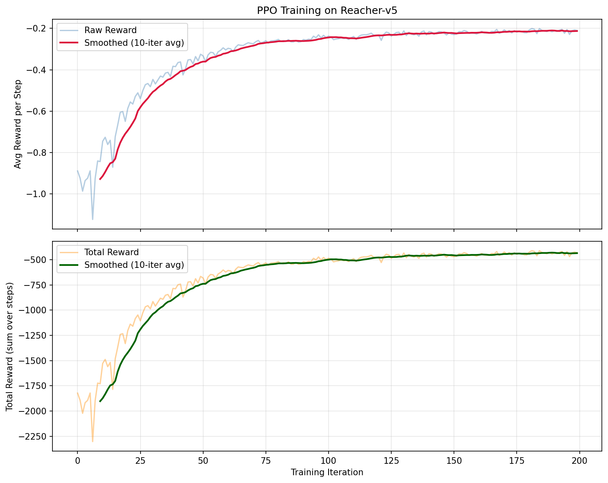
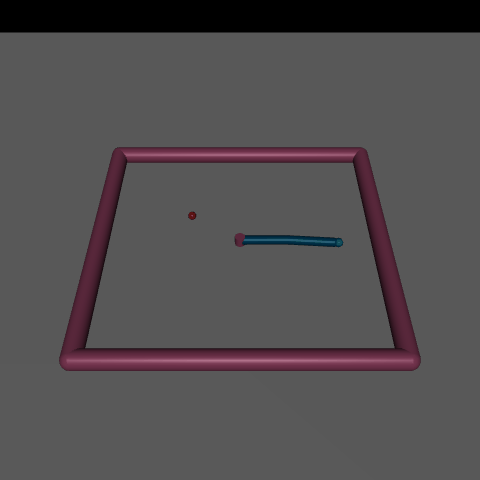

#  PyTorch Learning Lab

A hands-on collection of PyTorch projects documenting my journey from beginner to practitioner.  
Each project focuses on a core concept — from classical reinforcement learning to the Transformer architecture.

---

## 📋 Table of Contents

- [Project 1: Q-Learning Maze Solver](#-project-1-q-learning-maze-solver)
- [Project 2: Transformer Basics](#-project-2-transformer-basics)
- [Project 3: PPO Reacher Agent](#-project-3-ppo-reacher-agent)
- [Project Structure](#%EF%B8%8F-project-structure)
- [Setup & Installation](#%EF%B8%8F-setup--installation)
- [References](#-references)
- [License](#-license)

---

## 🏗️ Project Structure

```
pytorch-learning-lab/
├── README.md
├── requirements.txt
├── .gitignore
│
├── 01_q_learning_maze/
│   ├── maze_env.py          # SimpleMaze environment (4×4 grid world)
│   ├── q_learning_agent.py  # Tabular Q-Learning agent
│   ├── train.py             # Training loop + reward curve + agent GIF
│   └── results/
│       ├── training_reward_curve.png
│       └── maze_agent.gif
│
├── 02_transformer_basics/
│   ├── transformer_block.py  # SimpleSelfAttention + TransformerBlock
│   ├── sentiment_analysis.py # Sentiment analysis with Hugging Face
│   └── text_generation.py    # Text generation with GPT-2
│
├── 03_ppo_reacher/
│   ├── networks.py      # PolicyNetwork (actor) and ValueNetwork (critic)
│   ├── ppo.py           # PPO algorithm: rollout, GAE, PPO-Clip update
│   ├── train.py         # Training loop with argparse and result saving
│   ├── evaluate.py      # Model evaluation and GIF recording
│   ├── explore_env.py   # Environment exploration and reward analysis
│   └── results/
│       ├── trained_model.pth
│       ├── training_reward_curve.png
│       └── trained_agent.gif
│
└── assets/
```

---

## 🐭 Project 1: Q-Learning Maze Solver

### Overview

A Q-Learning agent that learns to navigate a 4×4 maze to find the cheese.  
The agent starts at the top-left corner **(0, 0)** and must reach the goal at **(3, 3)**, avoiding two walls.

```
┌───┬───┬───┬───┐
│ S │   │   │   │     S = Start (0, 0)
├───┼───┼───┼───┤
│   │ X │   │   │     X = Wall (impassable)
├───┼───┼───┼───┤
│   │   │ X │   │     G = Goal / Cheese (3, 3)
├───┼───┼───┼───┤
│   │   │   │ G │
└───┴───┴───┴───┘
```

### Key Concepts

| Concept | Description |
|---|---|
| **Q-Table** | Dictionary mapping `(state, action) → expected reward` |
| **Bellman Equation** | `Q(s,a) ← Q(s,a) + α [r + γ max Q(s',a') − Q(s,a)]` |
| **Epsilon-Greedy** | Explore randomly with probability ε, exploit best action otherwise |
| **Epsilon Decay** | ε shrinks each episode so the agent exploits more as it learns |

### Results

| Training Reward Curve | Trained Agent Navigation |
|:---:|:---:|
|  |  |

### How to Run

```bash
cd 01_q_learning_maze
python train.py
```

Output files are saved to `01_q_learning_maze/results/`.

---

## 🤖 Project 2: Transformer Basics

### Overview

Exploring the building blocks of modern large language models using PyTorch and Hugging Face.  
Includes a from-scratch self-attention implementation as well as pre-trained model inference.

### Key Concepts

| Concept | File |
|---|---|
| **Scaled Dot-Product Self-Attention** | `transformer_block.py` — `SimpleSelfAttention` |
| **Full Transformer Encoder Block** | `transformer_block.py` — `TransformerBlock` |
| **Sentiment Analysis** | `sentiment_analysis.py` — DistilBERT via HF pipeline |
| **Text Generation (GPT-2)** | `text_generation.py` — GPT-2 via HF pipeline |

### Self-Attention at a Glance

```
Q = X W_Q
K = X W_K                      (B, T, D)
V = X W_V
                                   ↓
Attention(Q, K, V) = softmax( Q Kᵀ / √d_k ) V
```

### How to Run

```bash
cd 02_transformer_basics

# Test the from-scratch Transformer block
python transformer_block.py

# Run sentiment analysis (downloads DistilBERT on first run)
python sentiment_analysis.py

# Run text generation (downloads GPT-2 on first run)
python text_generation.py
```

---

## 🤖 Project 3: PPO Reacher Agent

### Overview

A PPO agent trained from scratch using PyTorch to control a 2-DOF robotic arm in the MuJoCo Reacher-v5 environment. The agent learns to coordinate two joint torques to move its fingertip to a randomly placed target.

### Key Concepts

| Concept | Description |
|---|---|
| **Proximal Policy Optimization (PPO-Clip)** | Clipped surrogate objective for stable on-policy updates |
| **Generalized Advantage Estimation (GAE)** | Bias–variance trade-off in advantage computation |
| **Continuous action space** | Gaussian policy over joint torques |
| **Actor-Critic architecture** | Separate policy and value networks |

### Results

| Training Reward Curve | Trained Agent Demo |
|:---:|:---:|
|  |  |

### How to Run

```bash
cd 03_ppo_reacher

# Explore the environment
python explore_env.py

# Train the agent
python train.py --num_iterations 200 --steps_per_iter 2048

# Evaluate and save a GIF
python evaluate.py --model_path results/trained_model.pth --save_gif
```

---

## 🛠️ Setup & Installation

**Prerequisites:** Python 3.9+

```bash
# Clone the repository
git clone https://github.com/YOUR_USERNAME/pytorch-learning-lab.git
cd pytorch-learning-lab

# Install dependencies
pip install -r requirements.txt
```

> **Note:** `torch` installation varies by platform. Visit [pytorch.org](https://pytorch.org/get-started/locally/) to get the correct command for your CUDA version.

---

## 📚 References

- Sutton & Barto — [*Reinforcement Learning: An Introduction*](http://incompleteideas.net/book/the-book-2nd.html) (2018)
- Vaswani et al. — [*Attention Is All You Need*](https://arxiv.org/abs/1706.03762) (2017)
- Schulman et al. — [*Proximal Policy Optimization Algorithms*](https://arxiv.org/abs/1707.06347) (2017)
- Schulman et al. — [*High-Dimensional Continuous Control Using Generalized Advantage Estimation*](https://arxiv.org/abs/1506.02438) (2016)
- [Hugging Face Transformers Documentation](https://huggingface.co/docs/transformers/index)
- [PyTorch Documentation](https://pytorch.org/docs/stable/index.html)
- [Gymnasium Reacher-v5 Documentation](https://gymnasium.farama.org/environments/mujoco/reacher/)

---

## 📝 License

This project is licensed under the [MIT License](https://opensource.org/licenses/MIT).  
Feel free to use, modify, and distribute for educational purposes.
