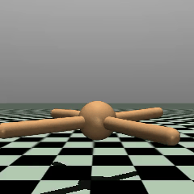

# PyTorch ML Portfolio

From-scratch implementations of core machine learning systems in PyTorch, spanning reinforcement learning, NLP, and retrieval-augmented generation.  
This repository is engineered as a reproducible portfolio of end-to-end ML builds: algorithm design, training pipelines, evaluation artifacts, and deployment-oriented tooling.

[](https://python.org)
[](https://pytorch.org)
[](https://mujoco.readthedocs.io)
[](https://opensource.org/licenses/MIT)

---

## ✨ Highlights

| Project | Task | Key Result |
| :-------- | :----- | :----------- |
| [🐭 Q-Learning Maze](#-1-q-learning-maze-solver) | Tabular RL on 4×4 grid | Optimal policy in ~300 episodes |
| [🤖 Transformer Basics](#-2-transformer-basics-pytorch--hf-integration) | Self-attention from scratch | Custom encoder block + HuggingFace inference |
| [🦾 PPO Reacher](#-3-ppo-reacher-agent-mujoco) | 2-DOF robotic arm control | Converged policy via PPO-Clip + GAE |
| [🧟 RAG Assistant](#-4-local-rag-assistant) | Local retrieval-augmented QA | End-to-end pipeline: ChromaDB + TinyLlama |
| [🐜 PPO Ant Walker](#-5-ppo-ant-walker-mujoco) | Quadruped locomotion (8-DOF) | **Peak reward +632** · obs/reward norm · LR annealing |

---

## What This Repository Demonstrates

- End-to-end RL engineering with PPO in continuous control environments (`Reacher-v5`, `Ant-v5`)
- Core transformer components implemented directly in PyTorch (self-attention + encoder block)
- RAG pipeline design with local inference, embedding retrieval, and grounded generation
- Training/evaluation outputs tracked as reproducible artifacts (plots, GIFs, logs, checkpoints)

---

## Featured Projects

### 🐭 1) Q-Learning Maze Solver
**Problem solved:** autonomous path planning in a constrained grid world with sparse reward.  
**Built:** tabular Q-learning agent with epsilon-greedy exploration and decaying exploration schedule.

**Engineering highlights**
- Environment simulation in `01_q_learning_maze/maze_env.py`
- Q-value update loop and policy logic in `01_q_learning_maze/q_learning_agent.py`
- Reproducible training artifacts: reward curve + trajectory GIF

**Results**

| Training Curve | Agent Demo |
| :---: | :---: |
|  |  |

---

### 🤖 2) Transformer Basics (PyTorch + HF Integration)
**Problem solved:** implementing and validating transformer primitives, then applying them to production-grade NLP inference workflows.  
**Built:** from-scratch `SimpleSelfAttention` and `TransformerBlock`, plus sentiment and generation inference scripts.

**Engineering highlights**
- Scaled dot-product attention in `02_transformer_basics/transformer_block.py`
- DistilBERT sentiment inference in `02_transformer_basics/sentiment_analysis.py`
- GPT-2 generation workflow in `02_transformer_basics/text_generation.py`

---

### 🦾 3) PPO Reacher Agent (MuJoCo)
**Problem solved:** stable control of a 2-DOF robotic arm in a continuous action space.  
**Built:** PPO-Clip + GAE training pipeline with actor-critic networks, rollout collection, and evaluation recording.

**Engineering highlights**
- PPO update logic in `03_ppo_reacher/ppo.py`
- Actor/critic models in `03_ppo_reacher/networks.py`
- Evaluation pipeline with saved demo output in `03_ppo_reacher/evaluate.py`

**Results**

| Training Curve | Agent Demo |
| :---: | :---: |
|  |  |

---

### 🧟 4) Local RAG Assistant
**Problem solved:** context-grounded QA without external API dependencies.  
**Built:** a full RAG stack (document loading, chunking, embedding, retrieval, and local LLM generation) using LangChain + ChromaDB.

**Engineering highlights**
- Modular pipeline across `04rag-assistant/src/step*.py`
- Fully local inference with TinyLlama-1.1B
- Grounded responses generated from retrieved top-k chunks

**Measured run**
- 20 chunks indexed from source document
- End-to-end execution completed in `~51.8s` (sample run)

---

### 🐜 5) PPO Ant Walker (MuJoCo)
**Problem solved:** high-dimensional locomotion control for an 8-actuator quadruped.  
**Built:** robust PPO training system with normalization, annealing, checkpoint/resume, and domain randomization.

**Engineering highlights**
- Achieves **peak reward +632** after **5M training steps**
- Observation normalization (`05_mujoco_ant/obs_normalizer.py`) with Welford statistics
- Reward normalization (`05_mujoco_ant/reward_normalizer.py`) for stable optimization
- Sim-to-real robustness hooks via domain randomization (`05_mujoco_ant/domain_random.py`)

**Results**

| Training Curve | Agent Demo |
| :---: | :---: |
|  |  |

---

## Quick Start

**Prerequisites:** Python 3.9+

```bash
git clone https://github.com/YOUR_USERNAME/pytorch-learning-lab.git
cd pytorch-learning-lab
pip install -r requirements.txt
```

> `torch` installation can vary by OS/CUDA. Use the selector at [pytorch.org](https://pytorch.org/get-started/locally/).

---

## Reproducibility

- Each project directory contains an executable training or inference entry point
- Output assets are written under project-local `results/` folders
- RL workflows include model checkpoints and evaluation scripts for reruns

---

## Repository Layout

```text
pytorch-learning-lab/
├── 01_q_learning_maze/
│   ├── maze_env.py                # Grid world environment
│   ├── q_learning_agent.py        # Q-table agent with ε-greedy
│   ├── train.py                   # Training loop
│   └── results/                   # Reward curve + agent GIF
├── 02_transformer_basics/
│   ├── transformer_block.py       # Self-attention + encoder block
│   ├── sentiment_analysis.py      # DistilBERT inference
│   └── text_generation.py         # GPT-2 generation
├── 03_ppo_reacher/
│   ├── networks.py                # Actor-Critic networks
│   ├── ppo.py                     # PPO-Clip + GAE
│   ├── train.py                   # Training loop
│   ├── evaluate.py                # Evaluation + recording
│   └── results/                   # Reward curve + agent GIF
├── 04rag-assistant/
│   └── src/                       # Modular RAG pipeline steps
├── 05_mujoco_ant/
│   ├── networks.py                # ActorCritic (shared encoder)
│   ├── ppo_agent.py               # PPO agent with buffer
│   ├── obs_normalizer.py          # Welford running normalization
│   ├── reward_normalizer.py       # Reward variance scaling
│   ├── domain_random.py           # Sim-to-real randomization
│   ├── train.py                   # Training with checkpoint/resume
│   ├── record.py                  # MP4/GIF recording
│   └── results/                   # Reward curve + agent GIF
├── requirements.txt
└── README.md
```

---

## References

**Reinforcement Learning**
- Sutton & Barto — [*Reinforcement Learning: An Introduction*](http://incompleteideas.net/book/the-book-2nd.html)
- Schulman et al. — [*Proximal Policy Optimization Algorithms*](https://arxiv.org/abs/1707.06347)
- Schulman et al. — [*Generalized Advantage Estimation*](https://arxiv.org/abs/1506.02438)

**NLP & Transformers**
- Vaswani et al. — [*Attention Is All You Need*](https://arxiv.org/abs/1706.03762)

**Retrieval-Augmented Generation**
- Lewis et al. — [*Retrieval-Augmented Generation*](https://arxiv.org/abs/2005.11401)

**Documentation**
- [PyTorch](https://pytorch.org/docs/stable/index.html)
- [MuJoCo](https://mujoco.readthedocs.io/)
- [Gymnasium Ant-v5](https://gymnasium.farama.org/environments/mujoco/ant/)

---

## License

This repository is licensed under the [MIT License](https://opensource.org/licenses/MIT).
